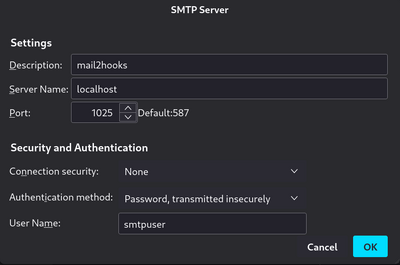
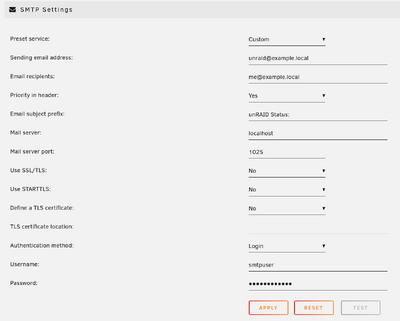

# mail2hooks

mail2hooks for the rescue, if an application only supports to send notifications via email but you like to use your favorite messenger - or any other service - for this.

This project was originally initiated, because [Unraid](https://unraid.net/) does (as of 2023-01-20) not support sending notifications to the [Signal](https://www.signal.org/) messenger yet.

## Features

- Integrate any application which supports sending notifications via email as mail2hooks acts as a SMTP server
- Distribute the mails to any webhook based on the email recipient
- Use additional filters to configure which mails will be forwarded
- Change the email subject or content based on regular expressions before forwarding the message 
- Flexible configuration and simple setup

## Requirements

To run mail2hooks, you just need a working container runtime environment (Docker, Podman, Kubernetes, ...).

## Getting Started

First you need to create a configuration file `config.json`, configure the server settings and all the hooks you would like to forward the messages to. An example of a configuration can be found in the provided [example configuration file](config.json.example).

The configuration contains two main sections:

```json
{
    "server": ...
    "hooks": ...
}
```

The `server` section contains the configuration of the SMTP server itself. This includes the credentials for authorization and the (optional) port to use.

```json
{
    "server": {
        "credentials": {
            "user": "smtpuser",
            "password": "smtppassword"
        },
        "port": "1025"
    },
    "hooks": ...
}
```

The `hooks` section contains the configuration of one or more webhooks to forward email messages to. Each webhook has the following attributes:
* `comment` -
  (Optional) Comment the hook with any text which describes its purpose
* `mailto` -
  If the client application is sending an email to this recipient, this hook will be executed
* `accept` -
  (Optional) A list of regular expressions which the mail subject or the mail content must match before forwarding the message to the webhook. A message must match all the configured expressions. If `accept` is not set or empty, every mail will match.
* `deny` -
  (Optional) A list of regular expressions, which prevent the message from being forwarded if any of the patterns in the list match the subject or the content
* `replace` -
  (Optional) Sometimes it might be necessary to cleanup the email message before forwarding it to the webhook. With this option it is possible to define regular expressions to select strings and replace it with some other text. The mapping `"\t": "    "` would replace all tabs with spaces.
* `target` -
  Target URL (http/https) of the webhook
* `method` -
  (Optional) The request method required to use with the configured webhook. Usually `POST`, `PUT` or `GET`. The default value is `POST`
* `body` -
  The message which will be sent to the webhook. Can either be a simple string or a JSON object. Use the markers `%%SUBJECT%%` and `%%CONTENT%%` to insert the mail subject and/or the mail content
* `headers` -
  (Optional) List of headers required by the webhook. Can also contain required API keys, content descriptions and other key value pairs. Check the documentation of the webhook provider, to get information on what might be necessary.

```json
{
    "server": ...
    "hooks": [
        {
            "comment": "Example configuration to forward to the Signal REST API (https://github.com/bbernhard/signal-cli-rest-api)",
            "mailto": "me@example.local",
            "accept": [
              ".*ERROR.*"
            ],
            "deny": [
            ],
            "replace": {
                "\n": "\\n",
                "\r": "",
                "\t": "    "
            },
            "target": "http://signal-rest-api.example.local/v2/send",
            "method": "POST",
            "body": {
                "message": "%%SUBJECT%%\n\n%%CONTENT%%",
                "number": "+49123456789",
                "recipients": [
                    "+49987654321"
                ]
            },
            "headers": {
                "Content-Type": "application/json"
            }
        },
        {
          ...
        }
   ]
}
```

## Usage / Test

Run the Docker image:

```sh
$ docker run -p 1025:1025 -v ./config.json:/app/config.json innovatingdev/mail2hooks:latest
mail2hooks listening on port 1025
```

Configure the application or service to use mail2hooks as its SMTP server:
* Server name is the hostname running the mail2hooks container (e.g. `localhost`)
* Set the port to the port on which the server is exposed (e.g. `1025`)
* SSL/TLS are not supported yet, so disable it
* The authentication method has to be set to plain password authentication. Set the username and password according to your configuration.

Let the application send an email notification to the email address configured in the hook and make sure, the hook works.

### Examples application configuration

| Application/Service     | Screenshot (click to zoom) |
|-------------------------|----------------------------|
| Mozilla Thunderbird     |[](doc/config-thunderbird.png)|
| Unraid                  |[](doc/config-unraid.png)|


## Build the container image yourself

Clone the repository
```sh
$ git clone https://github.com/innovatingdev/mail2hooks.git
```

Change to the project directory and run the image build
```sh    
$ cd mail2hooks
$ docker build . -t mail2hooks:latest
STEP 1/10: FROM docker.io/library/node:lts-alpine
STEP 2/10: ENV MAIL2HOOKS_CONFIG='/app/config.json'
--> Using cache 517ddf15c2fccb20f6aa0ab9bc3428a19becc7dd0ebce1cd30ccd8019c178178

[...]

COMMIT mail2hooks:latest
--> eed9ee08aa9
Successfully tagged localhost/mail2hooks:latest
098286a544c6f569679967c8193c230191f145c9a6b3984b5ceb
```

Double check, that the image was built:
```sh
$ docker images
REPOSITORY                     TAG         IMAGE ID      CREATED       SIZE
localhost/mail2hooks           latest      eed9ee08aa9f  1 minute ago   272 MB
docker.io/library/node         lts-alpine  264f8646c2a6  1 minute ago   177 MB
```

Run the local container image:

```sh
$ docker run -p 1025:1025 -v ./config.json:/app/config.json localhost/mail2hooks:latest
mail2hooks listening on port 1025
```

## Reference

- Uses [`smtp-server`](https://nodemailer.com/extras/smtp-server/) library to setup the SMTP server
- Uses [`mailparser`](https://nodemailer.com/extras/mailparser/) to parse incoming mails
- The Node fetch API [available since Node.js 18](https://nodejs.org/en/blog/announcements/v18-release-announce/) to call the webhooks

## Contributors

Contributions are highly appreciated. It does not matter if you fork the repository and contribute code via pull requests, create examples of other webhook configurations, create issues if you find a bug or create a ticket if you have a feature request.

Everything is helpful!

## License

This software is licensed under the [GNU Affero General Public License Version 3](https://opensource.org/licenses/agpl-3.0) or later
